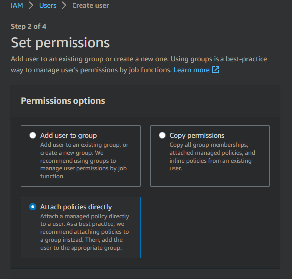
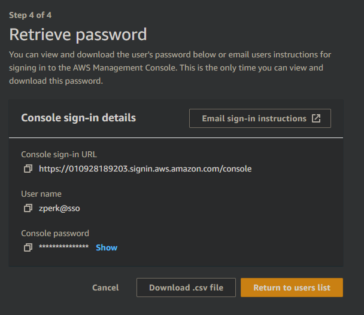

<!--BOOM!-->

### How to Configure the AWS CLI

1. **Install AWS CLI:**
   - Download and install the AWS CLI from [here](https://docs.aws.amazon.com/cli/latest/userguide/getting-started-install.html).
2. **Windows Installation:**
   - On Windows, install the AWS CLI using this command:
     ```sh
     msiexec.exe /i https://awscli.amazonaws.com/AWSCLIV2.msi
     ```
   - Follow common sense in the Windows installer.
     
3. **Create an AWS Account:**
   - Go to [AWS](https://aws.amazon.com/) and create an account if you don't have one.
4. **Manage Access to AWS Resources (IAM):**
   - After creating your account, search for "Manage access to AWS resources" (IAM):
     
5. **Create a User:**
   - In the IAM dashboard, create a new user:
     
6. **Set User Permissions:**
   - Assign appropriate permissions to the new user:
     
7. **Add Tags (Optional):**
   - Add tags to the user if needed.
8. **Review User Summary:**
   - Review the summary information for the new user:
     
9. **Configure AWS CLI:**
   - Configure your AWS CLI console using the credentials:
     
10. **Completion:**
    - Your AWS CLI is now configured.
    - Congrats.
11. **Tests:**
    - Check a lists of instances using `aws ec2 list-instances`:
      
    - Test an instance using `aws ec2 describe-instances` and `aws ec2 describe-hosts`:
      
12. **That's it:**
    - Congrats again.
