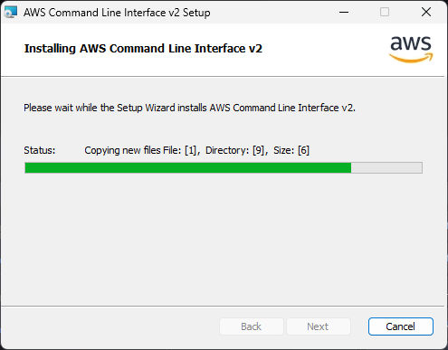
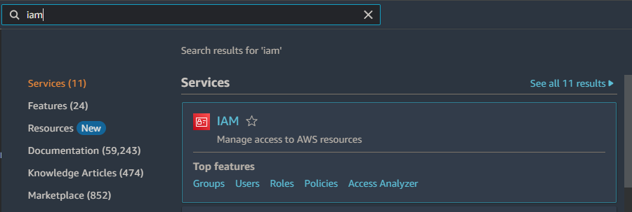
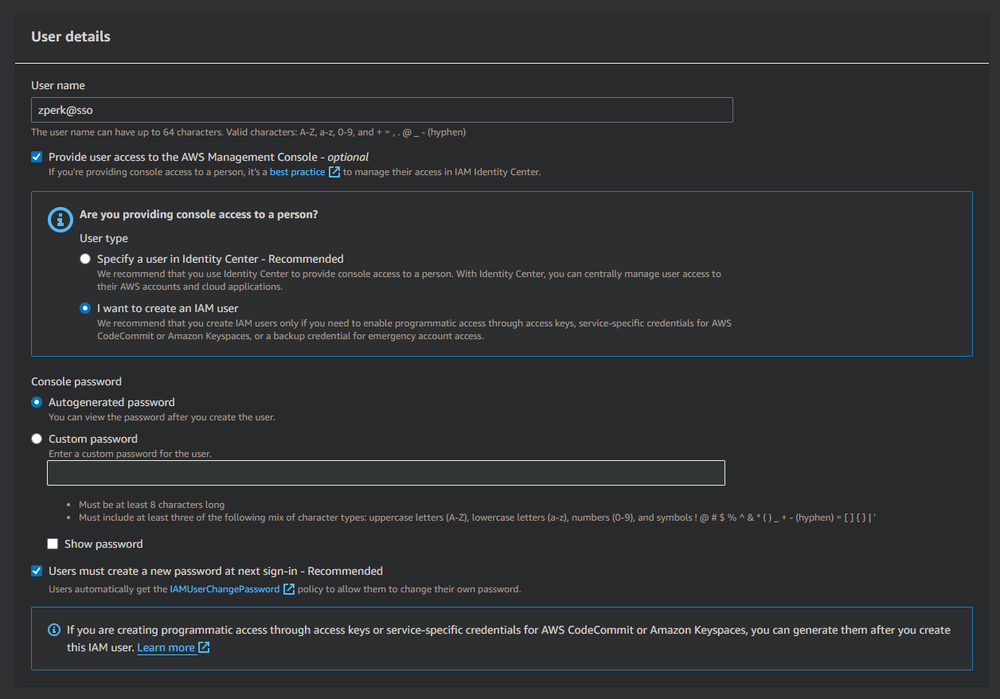
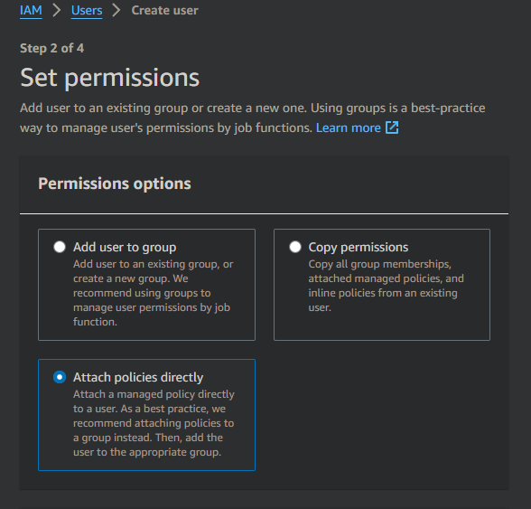
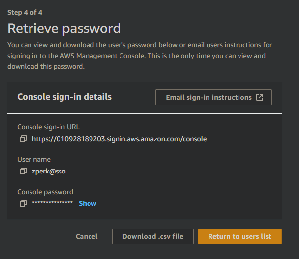
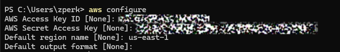
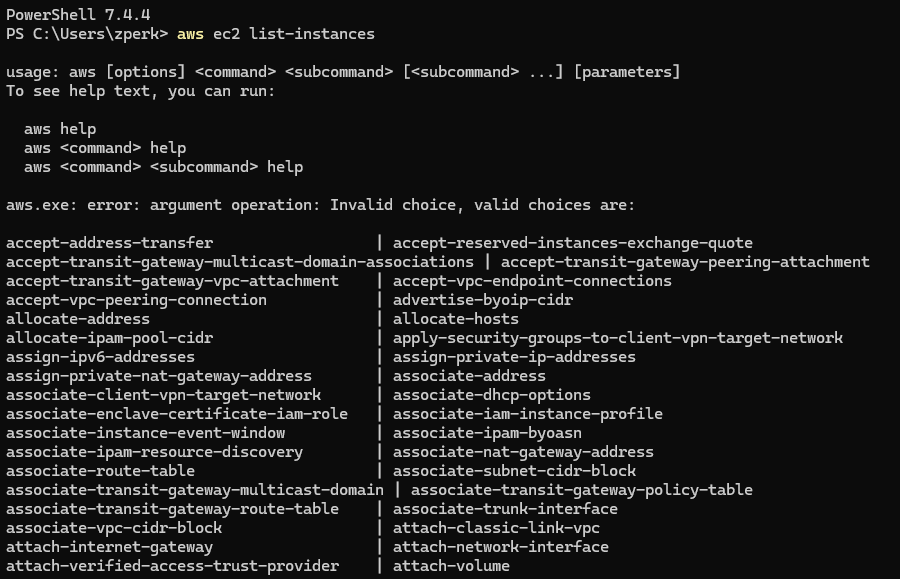
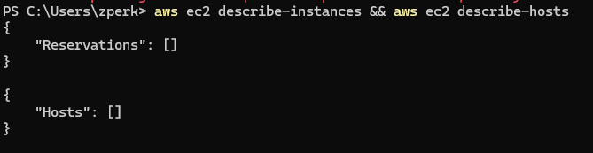

<!--BOOM!-->

### Cómo configurar la CLI de AWS

1. **Instalar AWS CLI:**
   - Descarga e instala la CLI de AWS desde [aquí](https://docs.aws.amazon.com/cli/latest/userguide/getting-started-install.html).
2. **Instalación en Windows:**
   - En Windows, instala la CLI de AWS usando este comando:
     ```sh
     msiexec.exe /i https://awscli.amazonaws.com/AWSCLIV2.msi
     ```
   - Sigue el sentido común en el instalador de Windows.
     
3. **Crear una cuenta de AWS:**
   - Ve a [AWS](https://aws.amazon.com/) y crea una cuenta si no tienes una.
4. **Gestionar el acceso a los recursos de AWS (IAM):**
   - Después de crear tu cuenta, busca "Gestionar el acceso a los recursos de AWS" (IAM):
     
5. **Crear un usuario:**
   - En el panel de IAM, crea un nuevo usuario:
     
6. **Establecer permisos de usuario:**
   - Asigna los permisos apropiados al nuevo usuario:
     
7. **Agregar etiquetas (opcional):**
   - Agrega etiquetas al usuario si es necesario.
8. **Revisar el resumen del usuario:**
   - Revisa la información resumida del nuevo usuario:
     
9. **Configurar la CLI de AWS:**
   - Configura tu consola CLI de AWS usando las credenciales:
     
10. **Finalización:**
    - Tu CLI de AWS ahora está configurada.
    - Felicitaciones.
11. **Pruebas:**
    - Verifica una lista de instancias usando `aws ec2 list-instances`:
      
    - Prueba una instancia usando `aws ec2 describe-instances` y `aws ec2 describe-hosts`:
      
12. **Eso es todo:**
    - Felicitaciones de nuevo.
