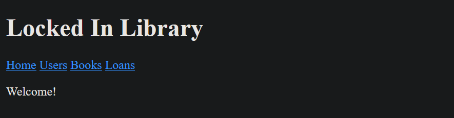
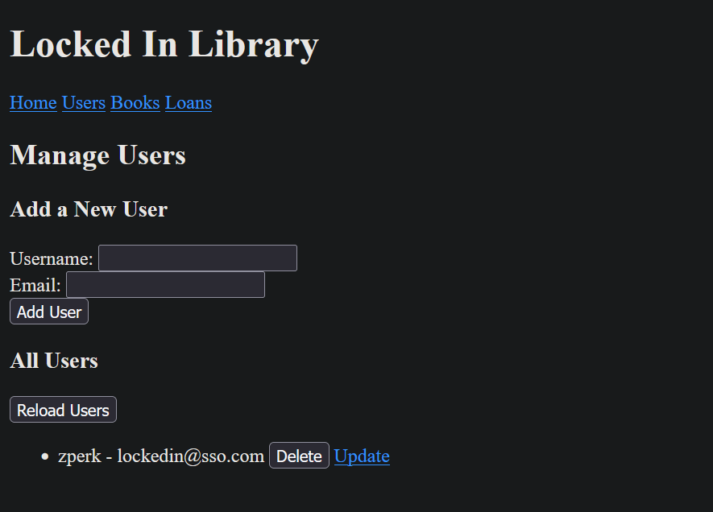
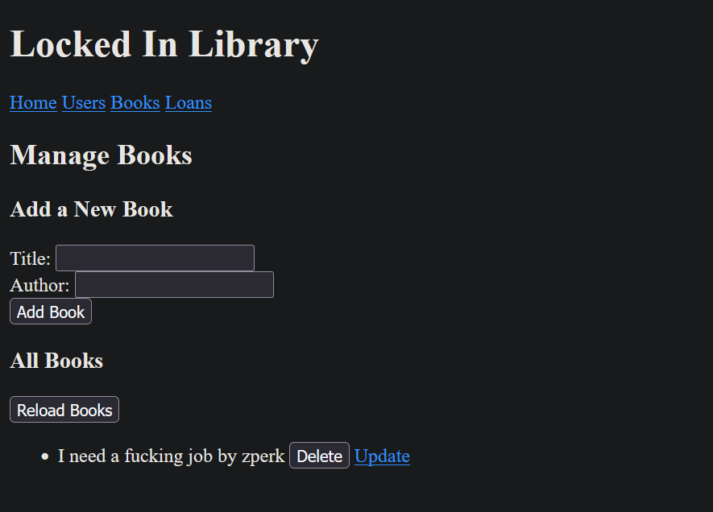
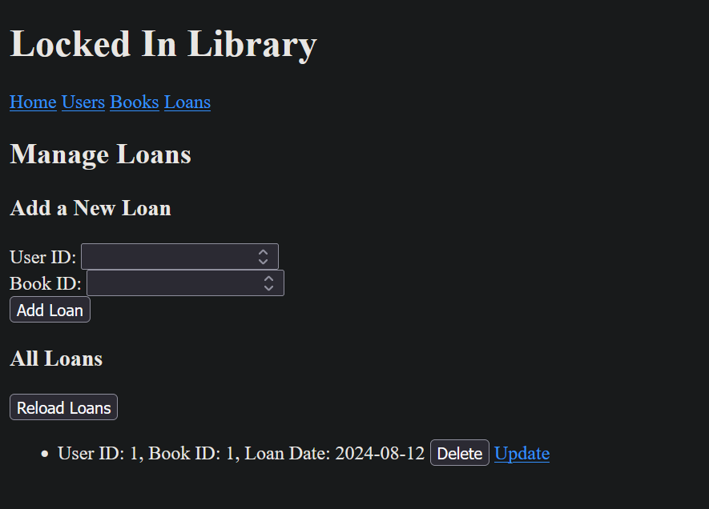
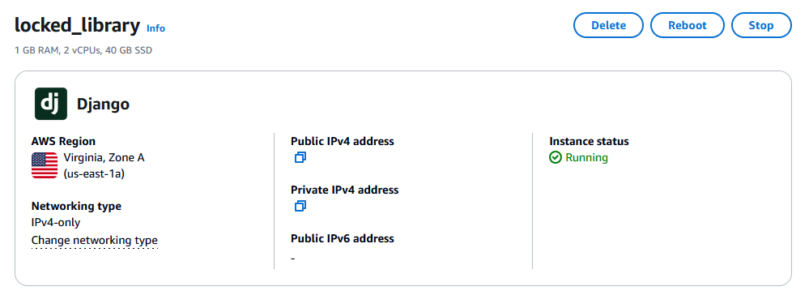
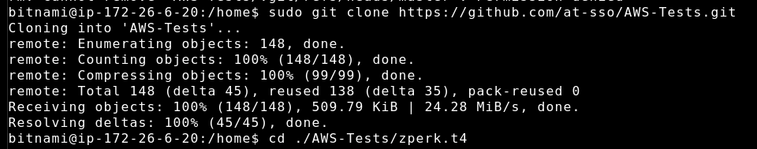

<!--Bruh I'm Locked In-->

# Library Management Web Application

This project is a Flask-based web application designed to manage users, books, and loans in a library. It includes features for adding, updating, deleting, and viewing these entities. The application is functional locally and can be deployed to Amazon Lightsail with the appropriate AWS environment setup.

## Index

- [Library Management Web Application](#library-management-web-application)
  - [Index](#index)
  - [Project Structure](#project-structure)
  - [Installation](#installation)
  - [Running the Application](#running-the-application)
  - [Features](#features)
    - [Manage Users](#manage-users)
    - [Manage Books](#manage-books)
    - [Manage Loans](#manage-loans)
  - [Deployment to Amazon Lightsail](#deployment-to-amazon-lightsail)

## Project Structure

```
.
├── app/
│   ├── __init__.py
│   ├── models.py
│   ├── routes.py
│   └── templates/
│       ├── base.html
│       ├── books.html
│       ├── index.html
│       ├── loans.html
│       ├── update_book.html
│       ├── update_loan.html
│       ├── update_user.html
│       └── users.html
├── manage.py
└── readme.md
```

- **`./app/__init__.py`**: Initializes the Flask app and configures the database.
- **`./app/models.py`**: Defines the database models for Users, Books, and Loans.
- **`./app/routes.py`**: Contains the routes for managing users, books, and loans.
- **`./templates/*`**: Contains the HTML templates used by the application.

## Installation

1. Clone this repository:

   ```bash
   git clone https://github.com/at-sso/AWS-Tests.git
   cd ./AWS-Tests
   ```

2. Set up a virtual environment and install the dependencies:

   ```bash
   sudo apt update
   sudo apt install python3-pip python3-venv
   python3 -m venv venv
   source venv/bin/activate
   pip install -r ./env/requirements.txt
   ```

3. Initialize the database:

   ```bash
   cd ./zperk.t4
   flask db init
   flask db migrate -m "Init"
   flask db upgrade
   ```

## Running the Application

To run the application locally:

```bash
export FLASK_APP=manage.py
export FLASK_ENV=development
flask run
```

The application will be available at `http://127.0.0.1:5000/` because I am not hosting the damn website.

## Features



### Manage Users

- **Add Users**: Enter a username and email to add a new user.
- **View Users**: All users are listed below the form, with options to update or delete each user.



### Manage Books

- **Add Books**: Enter a book title and author to add a new book.
- **View Books**: All books are listed below the form, with options to update or delete each book.



### Manage Loans

- **Add Loans**: Select a user and book to create a loan entry.
- **View Loans**: All loans are listed below the form, with options to update or delete each loan.



## Deployment to Amazon Lightsail

This application is designed to be deployed on Amazon Lightsail. To deploy, you'll need to:

1. **Set Up a Lightsail Instance**: Create an instance and configure it with your preferred Linux distribution.
   
2. **Install Dependencies**: SSH into your instance, clone the repository, and install Python and other dependencies.
   
   Set up environment variables and configure your database connection.
3. **Run the Application**: Use a WSGI server like Gunicorn to serve the Flask application.
   

**Note**: This [`readme.md`](./readme.md) does not cover the detailed steps for setting up an AWS environment! Please refer to the [AWS documentation](https://docs.aws.amazon.com/lightsail/) for more details.
