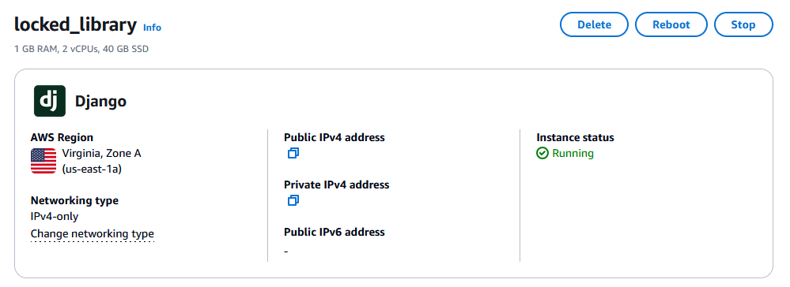
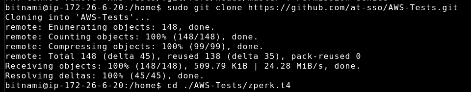
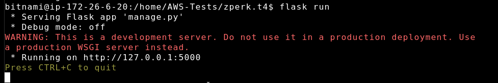

<!--Bruh I'm Locked In-->

# Aplicación Web de Gestión de Biblioteca

Este proyecto es una aplicación web basada en Flask diseñada para gestionar usuarios, libros y préstamos en una biblioteca. Incluye funciones para agregar, actualizar, eliminar y ver estas entidades. La aplicación es funcional localmente y se puede desplegar en Amazon Lightsail con la configuración adecuada del entorno AWS.

## Índice

- [Aplicación Web de Gestión de Biblioteca](#aplicación-web-de-gestión-de-biblioteca)
  - [Índice](#índice)
  - [Estructura del Proyecto](#estructura-del-proyecto)
  - [Instalación](#instalación)
  - [Ejecución de la Aplicación](#ejecución-de-la-aplicación)
  - [Características](#características)
    - [Gestionar Usuarios](#gestionar-usuarios)
    - [Gestionar Libros](#gestionar-libros)
    - [Gestionar Préstamos](#gestionar-préstamos)
  - [Despliegue en Amazon Lightsail](#despliegue-en-amazon-lightsail)

## Estructura del Proyecto

```
.
├── app/
│   ├── __init__.py
│   ├── models.py
│   ├── routes.py
│   └── templates/
│       ├── base.html
│       ├── books.html
│       ├── index.html
│       ├── loans.html
│       ├── update_book.html
│       ├── update_loan.html
│       ├── update_user.html
│       └── users.html
├── manage.py
└── readme.md
```

- **`./app/__init__.py`**: Inicializa la aplicación Flask y configura la base de datos.
- **`./app/models.py`**: Define los modelos de la base de datos para Usuarios, Libros y Préstamos.
- **`./app/routes.py`**: Contiene las rutas para gestionar usuarios, libros y préstamos.
- **`./templates/*`**: Contiene las plantillas HTML utilizadas por la aplicación.

## Instalación

1. Clona este repositorio:

   ```bash
   git clone https://github.com/at-sso/AWS-Tests.git
   cd ./AWS-Tests
   ```

2. Configura un entorno virtual e instala las dependencias:

   ```bash
   sudo apt update
   sudo apt install python3-pip python3-venv
   python3 -m venv venv
   source venv/bin/activate
   pip install -r ./env/requirements.txt
   ```

3. Inicializa la base de datos:

   ```bash
   cd ./zperk.t4
   flask db init
   flask db migrate -m "Iniciar"
   flask db upgrade
   ```

## Ejecución de la Aplicación

Para ejecutar la aplicación localmente:

```bash
export FLASK_APP=manage.py
export FLASK_ENV=development
flask run
```

La aplicación estará disponible en `http://127.0.0.1:5000/` porque no estoy hospedando el sitio web.

## Características


### Gestionar Usuarios

- **Agregar Usuarios**: Ingresa un nombre de usuario y un correo electrónico para agregar un nuevo usuario.
- **Ver Usuarios**: Todos los usuarios se enumeran debajo del formulario, con opciones para actualizar o eliminar cada usuario.


### Gestionar Libros

- **Agregar Libros**: Ingresa un título de libro y un autor para agregar un nuevo libro.
- **Ver Libros**: Todos los libros se enumeran debajo del formulario, con opciones para actualizar o eliminar cada libro.


### Gestionar Préstamos

- **Agregar Préstamos**: Selecciona un usuario y un libro para crear una entrada de préstamo.
- **Ver Préstamos**: Todos los préstamos se enumeran debajo del formulario, con opciones para actualizar o eliminar cada préstamo.


## Despliegue en Amazon Lightsail

Esta aplicación está diseñada para ser desplegada en Amazon Lightsail. Para desplegarla, necesitarás:

1. **Configurar una Instancia de Lightsail**: Crea una instancia y configúrala con tu distribución de Linux preferida.
   
2. **Instalar Dependencias**: Conéctate a tu instancia vía SSH, clona el repositorio e instala Python y otras dependencias.
   
   Configura las variables de entorno y configura tu conexión a la base de datos.
3. **Ejecutar la Aplicación**: Usa un servidor WSGI como Gunicorn para servir la aplicación Flask.
   

**Nota**: Este [`readme.md`](./readme.sp.md) no cubre los pasos detallados para configurar un entorno AWS. ¡Por favor, consulta la [documentación de AWS](https://docs.aws.amazon.com/lightsail/) para más detalles!
