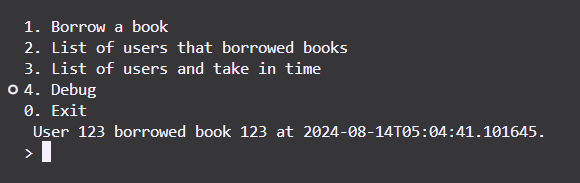
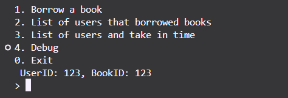
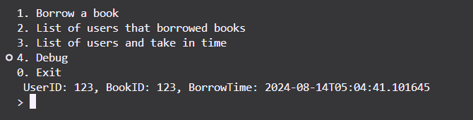
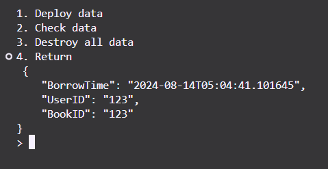
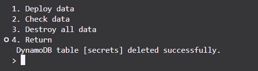

# DynamoDB Library Management System

This is a simple Python application that interacts with AWS DynamoDB to manage a small library system. The application allows users to borrow books, list borrowers, and manage DynamoDB tables for storing data.

## Features

- **Borrow Books:** Users can borrow books by entering a user ID and book ID.
- **List Borrowers:** Display a list of users who have borrowed books.
- **List Users with Borrow Times:** Display a list of users along with the time they borrowed books.
- **Debug Mode:**
  - Deploy DynamoDB Table
  - Check Data in the Table
  - Destroy DynamoDB Table

## Getting Started

### Prerequisites

- **Python 3.x** installed on your system.
- **AWS Account** with access to DynamoDB.
- **AWS CLI** configured with appropriate permissions to manage DynamoDB tables.

### Installation

1. Clone the repository to your local machine.
2. Install the required Python packages:

   ```sh
   pip install boto3
   ```

3. Set up your AWS credentials by configuring the AWS CLI:

   ```sh
   aws configure
   ```

4. Update the `clownkey` file with your DynamoDB table name and AWS secrets.

### Usage

All of this data is being fetch from DynamoDB.

1. **Run the Application:**

   ```sh
   python3 ./zperk.t5/src/main.py -H -w
   ```

2. **Main Menu Options:**
   - `1. Borrow a book` - Enter the user ID and book ID to borrow a book.
     
   - `2. List of users that borrowed books` - Displays all users who have borrowed books.
     
   - `3. List of users and borrow time` - Displays all users with their borrow times.
     
   - `4. Debug` - Access the [debug mode](#debug-mode) to manage DynamoDB tables.
   - `0. Exit` - Exit the application.

### Debug Mode

- **Deploy Data:** Creates the DynamoDB table if it doesn't exist.
  
- **Check Data:** Displays the data currently in the DynamoDB table.
  
- **Destroy Data:** Deletes the DynamoDB table.
  
