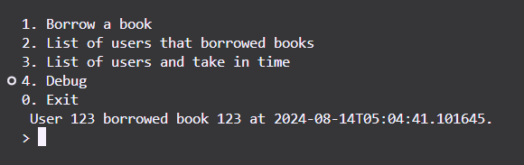
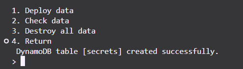
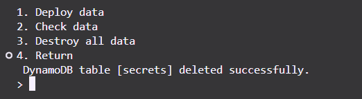

# Sistema de Gestión de Biblioteca con DynamoDB

Esta es una aplicación sencilla en Python que interactúa con AWS DynamoDB para gestionar un pequeño sistema de biblioteca. La aplicación permite a los usuarios tomar prestados libros, listar a los prestatarios y gestionar las tablas de DynamoDB para almacenar datos.

## Funcionalidades

- **Tomar Prestado Libros:** Los usuarios pueden tomar prestados libros ingresando un ID de usuario y un ID de libro.
- **Listar Prestatarios:** Muestra una lista de usuarios que han tomado prestados libros.
- **Listar Usuarios con Horarios de Préstamo:** Muestra una lista de usuarios junto con la hora en que tomaron prestados los libros.
- **Modo de Depuración:**
  - Desplegar Tabla DynamoDB
  - Comprobar Datos en la Tabla
  - Destruir Tabla DynamoDB

## Comenzando

### Requisitos Previos

- **Python 3.x** instalado en tu sistema.
- **Cuenta AWS** con acceso a DynamoDB.
- **AWS CLI** configurado con los permisos adecuados para gestionar las tablas de DynamoDB.

### Instalación

1. Clona el repositorio en tu máquina local.
2. Instala los paquetes de Python necesarios:

   ```sh
   pip install boto3
   ```

3. Configura tus credenciales de AWS configurando el AWS CLI:

   ```sh
   aws configure
   ```

4. Actualiza el archivo `clownkey` con el nombre de tu tabla DynamoDB y los secretos de AWS.

### Uso

Todos estos datos se están obteniendo de DynamoDB.

1. **Ejecuta la Aplicación:**

   ```sh
   python3 ./zperk.t5/src/main.py -H -w
   ```

2. **Opciones del Menú Principal:**
   - `1. Tomar prestado un libro` - Ingresa el ID de usuario y el ID del libro para tomarlo prestado.
     
   - `2. Lista de usuarios que tomaron prestados libros` - Muestra todos los usuarios que han tomado prestados libros.
     
   - `3. Lista de usuarios y tiempo de préstamo` - Muestra todos los usuarios con sus horarios de préstamo.
     
   - `4. Depuración` - Accede al [modo de depuración](#modo-de-depuración) para gestionar las tablas de DynamoDB.
   - `0. Salir` - Salir de la aplicación.

### Modo de Depuración

- **Desplegar Datos:** Crea la tabla DynamoDB si no existe.
  

- **Comprobar Datos:** Muestra los datos actualmente en la tabla DynamoDB.
  

- **Destruir Datos:** Elimina la tabla DynamoDB.
  
